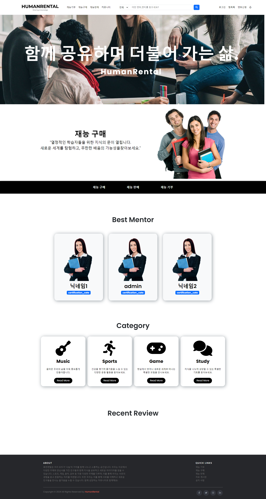

  

## Technologies Used

- Java Spring
- HTML (JSP)
- CSS (Bootstrap)
- JavaScript 
- Eclipse (IDE)
- Apache Tomcat server
- MySQL

## What Is HumanRental

<<<<<<< HEAD
휴먼 렌탈은 사용자 간 재능거래 및 기부 서비스를 활성화하기 위해 개발된 재능거래 웹 플랫폼입니다. 

이 플랫폼을 통해 사용자는 멘토로 등록하여 자신의 기술과 전문 지식을 다른 사용자에게 거래하거나 기부할 수 있습니다. 

또한 멘토와 멘티를 연결하여 요청이나 지원을 해결할 수 있는 만남의 장소를 제공합니다.
=======
휴먼 렌탈은 사용자 간 재능거래 및 기부 서비스를 활성화하기 위해 고안된 개인 재능거래 웹 플랫폼입니다.  
이 플랫폼을 통해 사용자는 멘토로 등록하여 자신의 기술과 전문 지식을 다른 사용자에게 거래하거나 기부할 수 있습니다.  
또한 멘토와 멘티를 연결하여 요청이나 지원을 해결할 수 있는 만남의 장소를 제공합니다. 
>>>>>>> branch 'GM' of https://github.com/HwangGwiMan/HumanRental.git

## Core Services

1. 플랫폼에 사용자로 회원 가입을 하세요.
2. 자격요건을 충족하시면 멘토 등록을 신청하세요.
3. 관리자는 귀하의 멘토 등록을 검토하고 승인/거절할 것입니다.
4. 승인되면 거래 또는 기부를 위해 기술을 제공할 수 있습니다.
5. 멘토/멘티와 소통하고 요청사항을 해결하기 위한 만남의 장소를 탐색해보세요.

## Views
- 메인 페이지

